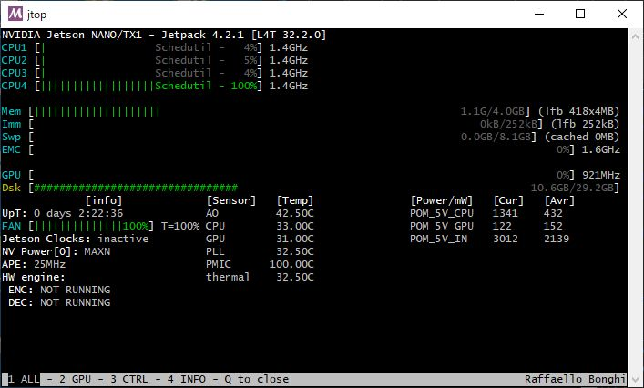
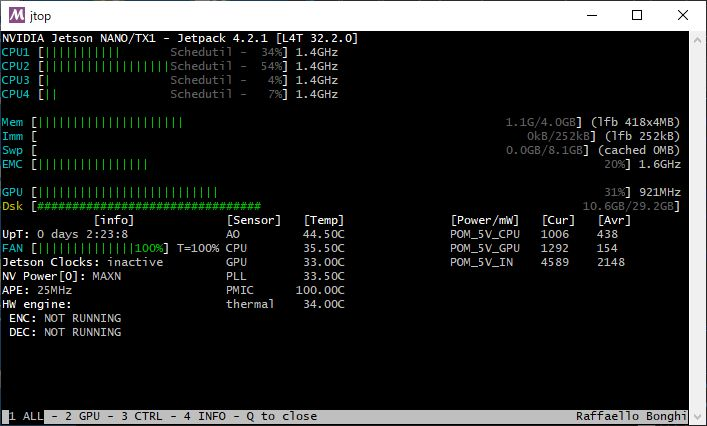

OpenCVの画像処理をGPU(CUDA)で高速化する

# この記事について
- Jetson NanoにGPU(CUDA)が有効なOpenCVをインストール
- PythonでOpenCVのCUDA関数を使って、画像処理(リサイズ)を行い、CPUとGPUの速度を比較
- C++でOpenCVのCUDA関数を使って、画像処理(リサイズ)を行い、CPUとGPUの速度を比較
- 結論 (512x512 -> 300x300のリサイズの場合)
	- 以下のように高速化できた
	- CPU: 2.8 [msec]
	- GPU: 約0.8 [msec]
- 注意
	- 画像サイズと処理内容によっては、GPUの方が遅くなるので注意

## 環境
- Jetson Nano (jetson-nano-sd-r32.2-2019-07-16.img)
- OpenCV 4.1.0

### 測定方法
処理時間測定の前には、以下コマンドを実施

```sh
sudo nvpmodel -m 0
sudo jetson_clocks
```

## コード
https://github.com/iwatake2222/OpenCV_CUDA


# OpenCV with GPU(CUDA)のインストール
基本的には、https://github.com/AastaNV/JEP/blob/master/script/install_opencv4.0.0_Nano.sh の通り。

<details>

<summary>ビルド・インストール手順</summary>

```sh: OpenCVInstall
### 依存パッケージのインストール ###
sudo apt update
sudo apt upgrade

sudo apt -y install cmake cmake-curses-gui
sudo apt -y install python3-dev python3-pip
sudo apt -y install libtbb-dev
sudo apt -y install libhdf5-dev libhdf5-serial-dev  gfortran libtesseract-dev libleptonica-dev  libatlas-base-dev liblapacke-dev 
sudo apt -y install libeigen3-dev
sudo apt -y install libjpeg8-dev libjasper-dev libpng12-dev
sudo apt -y install libtiff5-dev libtiff-dev
sudo apt -y install ffmpeg
sudo apt -y install libavcodec-dev libavformat-dev libswscale-dev libdc1394-22-dev libavresample-dev 
sudo apt -y install libvorbis-dev libxvidcore-dev libx264-dev libxvidcore-dev
sudo apt -y install libopencore-amrnb-dev libopencore-amrwb-dev
sudo apt -y install libxine2-dev libv4l-dev
sudo apt -y install libgstreamer1.0-dev libgstreamer-plugins-base1.0-dev gstreamer1.0-plugins-*
sudo apt -y install libgtk2.0-dev
sudo apt -y install libgtk-3-dev  libcanberra-gtk*
# sudo apt -y install libqtgui4 libqtwebkit4 libqt4-test libqt4-dev libqt4-opengl-dev python3-pyqt5

## workaround for libhdf5 ##
# sudo ln -s /usr/lib/arm-linux-gnueabihf/libhdf5_serial.so /usr/lib/arm-linux-gnueabihf/libhdf5.so
# sudo ln -s /usr/lib/arm-linux-gnueabihf/libhdf5_serial_hl.so /usr/lib/arm-linux-gnueabihf/libhdf5_hl.so


### OpenCVコードの取得 ###
cd /mnt/usbm/
mkdir work
cd work

cvVersion="4.1.0"

git clone https://github.com/opencv/opencv.git
cd opencv
git checkout $cvVersion
cd ..

### opencv_contribもビルドしたい場合 ###
git clone https://github.com/opencv/opencv_contrib.git
cd opencv_contrib
git checkout $cvVersion
cd ..

### Openビルド設定 ###
cd /mnt/usbm/work/opencv
mkdir build
cd build

cmake \
    -D CMAKE_BUILD_TYPE=RELEASE \
    -D CMAKE_INSTALL_PREFIX=/usr/local \
    -D OPENCV_GENERATE_PKGCONFIG=ON \
    -D ENABLE_NEON=ON \
    -D WITH_TBB=ON \
    -D WITH_V4L=ON \
    -D WITH_GSTREAMER=ON \
    -D WITH_FFMPEG=ON \
    -D WITH_QT=OFF \
    -D WITH_GTK=ON \
    -D WITH_GTK3=ON \
    -D WITH_CUDA=ON \
    -D OPENCV_EXTRA_MODULES_PATH=../../opencv_contrib/modules \
    ..

### OpenCVビルド、インストール ###
make -j4
sudo make install
sudo ldconfig

### バージョンチェック ###
python3
import cv2
cv2.__version__
print(cv2.getBuildInformation())
```

</details>

# PythonからOpenCVのCUDA関数を使う
## 参考
https://stackoverflow.com/questions/42125084/accessing-opencv-cuda-functions-from-python-no-pycuda/42157735 を見ると、以前はOpenCVのCUDA関数のPython用バインディングはなかったようですが、最近は追加されたようです。

ドキュメントはまだないようですが、https://github.com/opencv/opencv/blob/4.0.1/modules/python/test/test_cuda.py のテストコードが参考になります。

## コード
512x512のlenaさんの画像を読み込み、CPUとGPUでそれぞれ300x300にリサイズして、処理時間を測定しました。リサイズは10000回実施して平均値を取得しています。

GPU(CUDA)関数は、基本的に`cv2` の後ろに`cuda` が付くだけです。通常のCUDAプログラミングと同様に、デバイス(GPU)側メモリの確保と、ホスト->デバイスへのメモリ転送(`upload` )、デバイス->ホストへのメモリ転送(`download` )処理が必要です。

`cv2.cuda_GpuMat()` によるデバイスメモリ確保は、ループの外で1度だけ実施しました。これは、この処理にそこそこ時間がかかったためです。実際に使うときも、デバイスメモリ確保はinitなどで1度だけ実施した方が良いかもしれません。


```py:opencv_cuda.py
import sys
import time
import cv2

### VALUES
NUM_REPEAT = 10000

### Read source image
img_src = cv2.imread("resource/lena.jpg")
cv2.imshow('img_src', img_src)


### Run with CPU
time_start = time.time()
for i in range (NUM_REPEAT):
	img_dst = cv2.resize(img_src, (300, 300))
time_end = time.time()
print ("CPU = {0}".format((time_end - time_start) * 1000 / NUM_REPEAT) + "[msec]")
cv2.imshow('CPU', img_dst)


### Run with GPU
img_gpu_src = cv2.cuda_GpuMat()	# Allocate device memory only once, as memory allocation seems to take time...
img_gpu_dst = cv2.cuda_GpuMat()
time_start = time.time()
for i in range (NUM_REPEAT):
	img_gpu_src.upload(img_src)
	img_gpu_dst = cv2.cuda.resize(img_gpu_src, (300, 300))
	img_dst = img_gpu_dst.download()
time_end = time.time()
print ("GPU = {0}".format((time_end - time_start) * 1000 / NUM_REPEAT) + "[msec]")
cv2.imshow('GPU', img_dst)


key = cv2.waitKey(0)
cv2.destroyAllWindows()

print(cv2.cuda.getCudaEnabledDeviceCount())

```

## 結果
```txt: 結果
jetson@jetson-desktop:~/opencv_gpu$ python3 opencv_cuda.py
CPU = 2.863248324394226[msec]
GPU = 0.8919716835021972[msec]
1
```

ホスト-デバイス間のメモリ転送を含めても、GPUの方が3倍以上高速となりました。

### リソース使用量
CPU用resize実行中


GPU用resize実行中


# C++からOpenCVのCUDA関数を使う
## 参考
オフィシャルと思われるページは https://opencv.org/cuda/ なのですが、OpenCV4ではビルドエラーが出ました。ヘッダファイル名や、モジュール名が変わっています。ただ、コードの雰囲気はつかめると思います。
最新のリファレンスはこちらになります。
https://docs.opencv.org/4.1.1/d0/d60/classcv_1_1cuda_1_1GpuMat.html 

## コード
コードの流れはPython版と同じです。

```c++:main.cpp
#include <stdio.h>
#include <chrono>
#include <opencv2/opencv.hpp>
// #include <opencv2/gpu/gpu.hpp>
#include <opencv2/core/cuda.hpp>

#define NUM_REPEAT 10000

int main()
{
	cv::Mat imgSrc = cv::imread(RESOURCE_DIR"lena.jpg");
	cv::imshow("imgSrc", imgSrc);

	{
		cv::Mat imgDst;
		const auto& t0 = std::chrono::steady_clock::now();
		for (int i = 0; i < NUM_REPEAT; i++) cv::resize(imgSrc, imgDst, cv::Size(300, 300));
		const auto& t1 = std::chrono::steady_clock::now();
		std::chrono::duration<double> timeSpan = t1 - t0;
		printf("CPU = %.3lf [msec]\n", timeSpan.count() * 1000.0 / NUM_REPEAT);
		cv::imshow("CPU", imgDst);
	}

	{
		cv::cuda::GpuMat imgGpuSrc, imgGpuDst;
		cv::Mat imgDst;
		const auto& t0 = std::chrono::steady_clock::now();
		for (int i = 0; i < NUM_REPEAT; i++) {
			imgGpuSrc.upload(imgSrc);
			cv::cuda::resize(imgGpuSrc, imgGpuDst, cv::Size(300, 300));
			imgGpuDst.download(imgDst);
		}
		const auto& t1 = std::chrono::steady_clock::now();
		std::chrono::duration<double> timeSpan = t1 - t0;
		printf("GPU = %.3lf [msec]\n", timeSpan.count() * 1000.0 / NUM_REPEAT);
		cv::imshow("GPU", imgDst);
	}

	cv::waitKey(0);
	return 0;
}

```


## 結果
```txt: 結果
jetson@jetson-desktop:~/opencv_gpu/build$ ./App
CPU = 2.835 [msec]
GPU = 0.793 [msec]
```
Python版とほぼ同様に、GPUの方が3倍以上高速となりました。
CPUの処理時間はPythonとほぼ同様でしたが、GPUの処理時間はPython版より少し速くなりました。


# 注意
GPUで処理させれば、常に速くなるわけではありません。
今回は512x512を300x300にリサイズしました。
これを、例えば1920x1080->1280x720へのリサイズにしたら、GPU版の方が遅くなってしまいました。理由は、リサイズそのものの処理時間よりも、CPU-GPU間のメモリ転送の時間が長くなったためだと思われます。
(この画像サイズでも、行う画像処理がリサイズだけではなく、もっと複雑になればGPUで処理した方が有利になるかと思われます。)


# どなたかご存知でしたら教えてください!!
OpenCVでの処理(リサイズなど)を、簡単にマルチコア化する方法をどなたかご存知でしたら教えて頂けないでしょうか?
TBBを使ってスレッドを作る方法は色々見つかったのですが、単にcv::resize()をマルチコア動作で高速化させたいです。
(`cv::setNumThreads` ではダメでした。。。)
